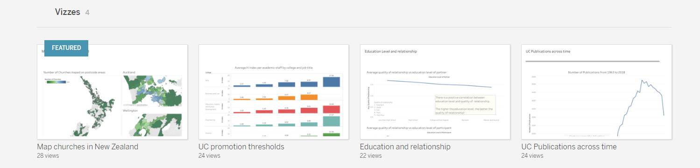

The [python directory](python) contains a python app I made. The app

The [R-Data-Wrangling.ipynb](R-Data-Wrangling.ipynb) is one of my previous work in R. I scraped mobile phone sales data from PBtech website, cleaned it and then presented it in various types of visulizations using ggplot2 package.

Some of my **Tabelau** works can be found here: https://public.tableau.com/profile/kevin6936

The [SKOPE Project report](SKOPE-Project-report.pdf) is the report I worte for my summer intership at SKOPE. The code and data are not avaliable anymore due to a NDA agreement with the company.
